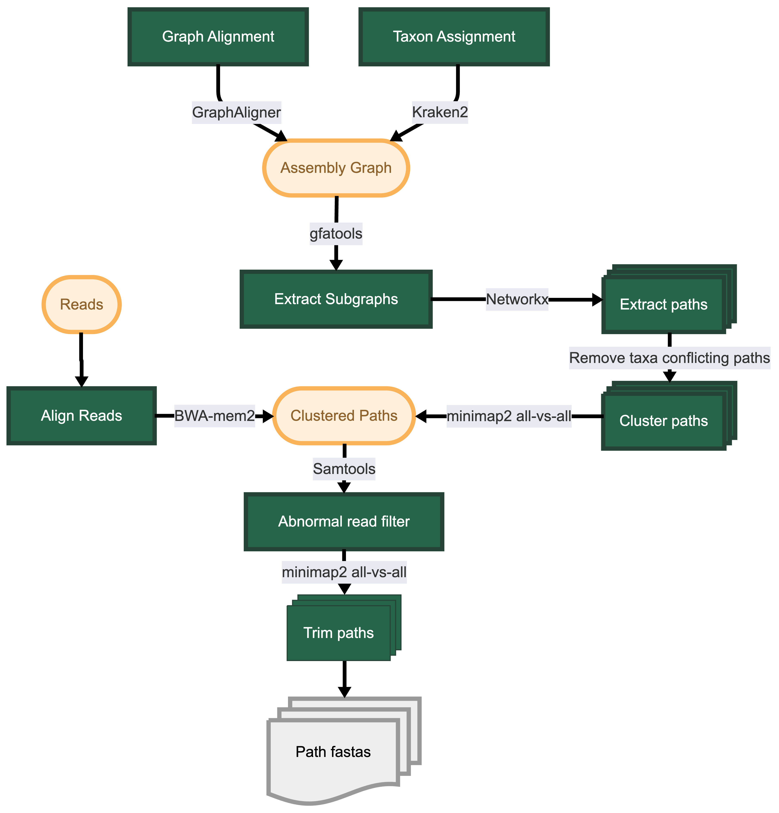

# Subgraph Analyser
[](https://github.com/maguire-lab/Subgraph_Analyser/actions/workflows/ci-tests.yml)


# Table of Contents
- [Overview](#overview)
- [Quick start](#quick-start)
- [Contributing](#contributing)

# Overview

Metagenomic data is very complex, containing many species with varying abundances. Metagenomic assembly often breaks in regions of assembly graph complexity, such as those caused by repeats within or between genomes; including genes shared between multiple species. The presence of these genes can often be identified via read mapping forgoing genomic context. However, understanding the genomic context of these genes is important for understanding their potential mobility and host(s). Querying the assembly graph has been shown to identify more genes precisely than querying assembled contigs alone. However, assembly graphs are large complex data structures and extracting meaningful information from them is not trivial.

Subgraph Analyser is a pipeline designed to extract and analyse the sequence surrounding a gene/segment of interest in a subgraph. This pipeline is designed for AMR gene neighbourhood analysis, but can be used for any gene of interest. Following graph alignment, subgraphs surrounding alignments are extracted from the assembly-graph. In each subgraph all possible paths through the gene containing segment(s) are then determined. Following this, the pipeline aims to filter away the mis-assembled paths. Using Kraken2 a taxon is assigned to each graph segment, only paths that do not have conflicting taxonomic assignments are kept. Paths may also be subsets of each other except short graph segments; these are clustered using all-vs-all alignment. Finally, reads are aligned back to the path sequences. Paths that meet thresholds for abnormal read alignments, such as discordant reads and clipped reads, are filtered away. Path sequences that meet the above criteria are then outputted for further analysis. This includes identifying the species or multiple species that are most likely to be hosting the gene of interest, identify any mobile genetic elements, and annotate the remaining genes in the path. Subghraph Analyser is by nature less conservative than metagenomic assemblers, as with popular assemblers mis-assemblies are possible and users should be aware of this when interpreting results.



# Quick start

## Computational requirements
- Linux based operating system
- Minimum ~80 GB RAM (Dependant on Kraken2 database chosen)
- More cores will speed up the pipeline
- Minimum ~400 GB disk space if using the default databases (kraken2 standard refseq bacteria db, bakta light db, card protein homolog db)

## Clone the repository
```bash
git clone https://github.com/maguire-lab/Subgraph_Analyser.git
```

## Install Conda/Mamba and Nextflow
- Install [`nextflow`](https://nf-co.re/usage/installation)
- Install [`conda`](https://docs.conda.io/projects/conda/en/stable/user-guide/getting-started.html) or [`mamba`](https://mamba.readthedocs.io/en/latest/installation/mamba-installation.html)

## Set database paths
- Edit `nextflow.config` to set the paths to the required databases in the standard and test profiles:
    - [kraken2 database](https://github.com/DerrickWood/kraken2/wiki/Manual#kraken-2-databases) path
    - [bakta database](https://github.com/oschwengers/bakta?tab=readme-ov-file#installation) path
    - gene multi-fasta file path (can use genes of interest or default [CARD](https://card.mcmaster.ca/download) protein homolog AMR gene sequences)
- If databases are not found at the specified paths they will be downloaded automatically on first use in these locations (expect large disk space requirements)
- See comments in `nextflow.config` for more information

## Test the pipeline
- [Download test data](https://doi.org/10.17605/OSF.IO/KDNM8) from the Open Science Framework (OSF) repository
- Run download script in the `subgraph_analyser` directory
```bash
cd Subgraph_Analyser/subgraph_analyser
sh test_data_download.sh
```

- Run the test
```bash
nf-test test tests/main.nf.test
```

## Inputs 
- A GFA format metagenomic assembly graph
    - See [agtools](https://github.com/Vini2/agtools/tree/main) or [Bandage](https://github.com/rrwick/Bandage) to convert from fastg to gfa if needed
- Reads used to create the assembly graph in fastq format
- Alternate genes of interest multi-fasta file if not using default CARD protein homolog AMR gene sequences. 

## Run the pipeline
```bash
nextflow run main.nf --graph <path/to/graph.gfa> --reads <path/to/reads_R{1,2}.fastq> 
```

## Outputs
- Path sequences in fasta format passing through the gene/segment of interest
- Summary of quantity of paths per gene at various quality thresholds
- metadata table with taxa identification and coverage information for each path
- .gbff annotation files for each path

# Contributing
Thank you for your interest in contributing to Subgraph Analyser! We use GitHub for managing issues, contribution requests and everything else. So feel free to communicate with us using new issues and discussions, whatever best fits your idea for your contribution.
## to do list
- [ ] Allow the same gene to be found multiple times in a graph to avoid errors
- [ ] implement database download functionality for first use - needs a process
- [ ] Implement long read support -> minimap2 for read mapping steps, alternate filtering criteria
- [ ] fix typo in DAG
- [ ] Add background colour to logo